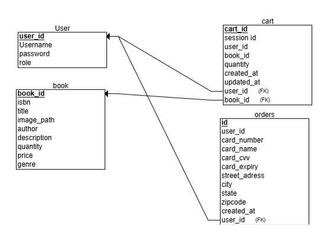

## Book Club Management Application

#### Group members:
##### 1.Kusala Nagamani Reddy

#### Narrative or Description:
###### The Book Club Management Application is a Flask and myPHPAdmin web-based platform designed to streamline the operations of an online book club. The application serves two primary user roles: Users and Admin.

#### Users can: 
###### 1.Able to Register and login the page
###### 2.Browse  books in Book section.
###### 3.Add books to their cart and place orders.
###### 4.View their order history.
###### 5.Able to Logout from the session

#### Admin can:
###### 1.Add, update, and delete books from the catalog.
###### 2.Perform data-driven analytics via the Admin Dashboard.

##### The Admin Dashboard provides key insights such as total sales, top-selling books, and active user metrics, along with graphical visualizations for better decision-making.

 
#### Relational Schema: 

#### Home Page

#### Register Page

#### Login Page

#### Admin Login Page

#### Admin Home Page

#### Admin Manage Books

#### ADD Book

#### Update Book

#### User Main Page

#### User Navigate to Books

#### Select the book for add to cart

#### Book added to Cart

#### Proceed to checkout and Billing

#### Order Placed

#### Order details

#### Log out

#### Dashboard

#### Analytical Queries in Admin Dashboard:

#### 1.Total sales:
###### Select SUM(b.price * c.quantity) AS total_sales FROM cart c 
JOIN book b ON c.book_id = b.id;

#### 2.Top Selling Books:
###### SELECT b.title, SUM(c.quantity) AS total_quantity FROM cart c 
JOIN book b ON c.book_id = b.id

GROUP BY b.id

ORDER BY total_quantity DESC

LIMIT 5;

#### 3.Active Users
###### SELECT u.username, COUNT(DISTINCT o.id) AS order_count

FROM user u

JOIN orders o ON u.id = o.user_id

GROUP BY u.id

ORDER BY order_count DESC

LIMIT 10;

